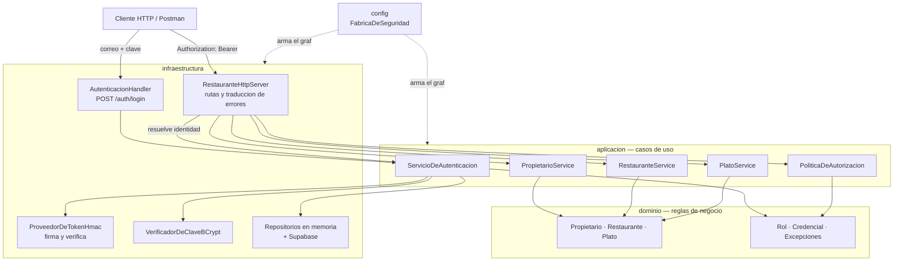

# Arquitectura — Sprint 1

Equipo 4 · Plazoleta de Comidas

## 1. Vision general

El proyecto es una aplicacion Java 17 sin framework: servidor HTTP del JDK
(`com.sun.net.httpserver`), persistencia en memoria y Supabase como destino
previsto. Se organiza en cuatro capas.

## 2. Capas y responsabilidades

| Capa | Contiene | Regla |
| --- | --- | --- |
| `dominio` | Entidades y reglas propias del negocio, excepciones | No conoce HTTP, ni base de datos, ni bcrypt |
| `aplicacion` | Casos de uso y **puertos** (interfaces) | Define lo que necesita; no sabe quien lo implementa |
| `infraestructura` | Adaptadores: HTTP, persistencia, bcrypt, token | Implementa los puertos |
| `config` | Ensamblado de dependencias | Unico sitio que conoce las implementaciones concretas |

La dependencia siempre apunta hacia adentro: infraestructura conoce aplicacion,
aplicacion conoce dominio, dominio no conoce a nadie.

## 3. Estado real de la aplicacion de capas

Honestidad sobre el alcance del Sprint 1:

- **HU-05 (seguridad) nace ya en capas**: `seguridad/dominio`, `seguridad/aplicacion`
  (con los puertos `RepositorioDeCredenciales`, `VerificadorDeClave`,
  `ProveedorDeToken`), `seguridad/infraestructura` y `config`.
- **HU-01 a HU-04 siguen con la estructura plana original** (`model`, `service`,
  `repository`, `controller`, `http`, `database`). Funcionan y estan probadas,
  pero mezclan reglas de negocio con detalles de infraestructura.

Esto queda registrado como **deuda tecnica declarada** para el Sprint 2. Se
decidio no refactorizar las cuatro historias ya terminadas en la vispera de la
entrega porque el riesgo de romper codigo probado superaba el beneficio.

## 4. Decisiones tecnicas

| # | Decision | Motivo | Alternativa descartada |
| --- | --- | --- | --- |
| 1 | Token propio firmado con HMAC-SHA256 | Los anexos exigen login, bcrypt y roles, pero no JWT. Solo usa el JDK, sin dependencias nuevas. | JWT con una libreria externa: agrega dependencia sin aportar nada que la HU pida |
| 2 | Identidad y rol dentro del token firmado | Antes el rol llegaba en un encabezado `X-Rol` que el cliente escribia a voluntad | Mantener `X-Rol`: cualquiera podia declararse ADMINISTRADOR |
| 3 | Matriz de autorizacion centralizada | Evita que cada servicio compare cadenas por su cuenta y olvide una regla | Comprobaciones dispersas en cada servicio |
| 4 | Persistencia en memoria detras de un puerto | Permite terminar el sprint sin bloquear por base de datos y cambiar a Supabase sin tocar casos de uso | Acoplar los casos de uso a Supabase |
| 5 | Secretos por variable de entorno | Checklist de PR: "sin secretos en Git" | Constantes en el codigo |

## 5. Modulos y responsables

| Modulo | HU | Responsable |
| --- | --- | --- |
| Usuarios | HU-01 | Simon |
| Seguridad | HU-05 | Simon |
| Restaurantes | HU-02 | Melina |
| Platos y menu | HU-03, HU-04 | Melina (reasignada) |
| Arquitectura, integracion y entrega | — | Molly |
